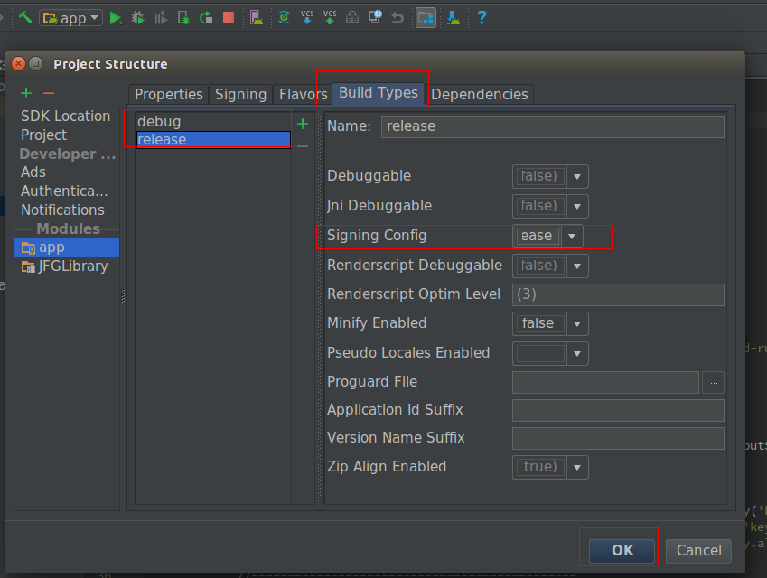

# SDK 接入流程


---

1.首先需要在[萝卜头运营平台][1]注册一个开发者账号。注册流程另有视频演示。

2.注册完成后，在“企业信息”-->“账号设置”中找到“企业编号”即是VID。“SDK密钥”即是VKEY。如果SDK密钥内容为空，则点击右侧的更换即可。
  

3.选择右下方的“+接入应用” ，填上自己的应用平台和应用信息。

   

4.在你的android 项目中接入SDK（此处以android studio项目为例）

 - 在AndroidManifest.xml文件中添加vid/vkey信息。如图：
   
 - 在app gradle中，applicationId 填上在平台上注册的包名。如图：

   
 - 在项目目录导入aar,和so 库文件。此处以armv7a 平台为例子。如图：

   
 - 在app gradle中添加签名信息。或者在IDE中配置。如图：

   
   
   

**注意！！！注意！！！注意！！！**

- 如果在项目中配备的vid/vkey/签名信息/包名信息 与在平台上注册的不一致，将不能登录。会报一个值为 160 的错误号。
- 如果应用没有签名，将会主动抛出一个运行时异常"Not signed in this apk !"。
- 如果从github 上获得源码，请更换上贵司的应用信息，vid/vkey等。

5.在代码中加载两个静态库文件。

```java
 static {
     System.loadLibrary("jfgsdk");
     System.loadLibrary("sqlcipher");
 }
```

6.初始化API ,注意添加sd卡的读写权限。最后一个参数为日志存放日志的路径。
方便以后查找问题，请在此路径下提取SmartCall_t.txt文件。
```java
     File dir = Environment.getExternalStorageDirectory();
        File file = new File(dir, "/JfgAppDemo");
        if (!file.exists()) {
            file.mkdir();
        }
        try {
           // Context , AppCallBack , log file path日志文件的存放路径。
            JfgAppCmd.initJfgAppCmd(this, cb, file.getAbsolutePath());
        } catch (PackageManager.NameNotFoundException e) {
            e.printStackTrace();
        }
```
 7.至此SDK接入已完成，接下来可以使用其他API。
 如： 注册，登录，添加设备，查看视频等等功能。

  [1]: http://open.robotscloud.com/