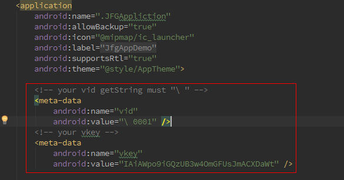

# 开始工作
1.首先到 http://test.robotscloud.com/ 官网注册贵司账号。

2.在企业信息中接入贵司的应用。

3.在android Manifests 中填入vid,和vkey。注意程序包名要与在平台中注册的一样。


4.加载静态库。

```java
 static {
     System.loadLibrary("jfgsdk");
     System.loadLibrary("sqlcipher");
 }
```
5.初始化SDK。 需要传入 Context,AppCallBack,日志路径 3个参数。
```java
JfgAppCmd.initJfgAppCmd(context, callBack, path);
```